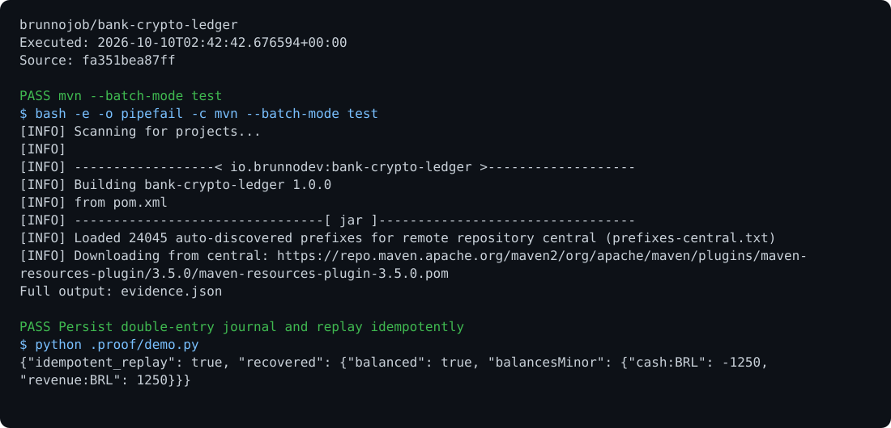

# Bank Ledger

An accounting engine and persistent journal of entries balanced by currency, with idempotency, file locking, integer precision, and hash-chain verification.

## Run

Requirements: Java 17 and Maven.

```sh
mvn test
mvn compile
java -cp target/classes io.brunnodev.ledger.Journal ledger.log post entrada_1 caixa receita BRL 1250
java -cp target/classes io.brunnodev.ledger.Journal ledger.log report > result.json
```

## Behavior

`Journal` records local entries and verifies balances by currency. `BankPlatform` contains transfer, account, and event rules. External banking integrations require their own contracts and credentials; this project does not move funds held by external institutions.

## Optional report archive

Use the [shared operations archive client](https://github.com/brunnojob/vercel-home-telemetry-api/tree/main/cloud) to queue `result.json` under project `bank-crypto-ledger`. The client uses `BRUNNODEV_ACCESS_TOKEN` and retains unacknowledged reports locally.

## License

Original source and documentation are MIT licensed; see [LICENSE](LICENSE). Third-party dependencies and media retain their respective terms. Maintained by [Brunno Dev](https://brunnodev.store).

## Implementation update

Transfers reserve destination capacity for all pending credits before debiting the source. Currency validation and integer overflow checks preserve balanced postings when a credit would exceed the account range. `tests/OverflowCheck.java` and `tests/JournalCheck.java` run in the Java regression workflow.

Contribution trailer: `Co-authored-by: nyctophile <329826984+ineedfoundmyway@users.noreply.github.com>`.

## Execution proof

[](https://github.com/brunnojob/bank-crypto-ledger/actions/workflows/proof.yml)



[Verified run](https://github.com/brunnojob/bank-crypto-ledger/actions/runs/38017949125) · [Execution report](docs/proof/evidence.json)

Run `python .proof/record.py` after installing the prerequisites above. The scenarios execute repository code and verify exit codes and expected output. CI publishes `execution-proof` with the transcript, input fingerprints and source commit. The downloadable report identifies the exact tested version; the workflow badge tracks the latest run.
